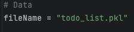
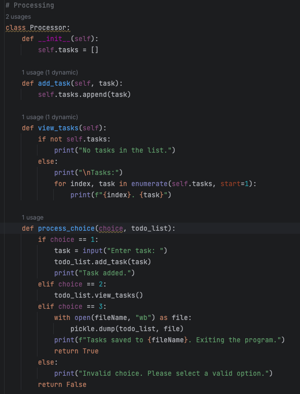
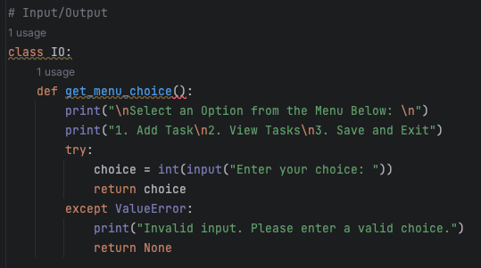
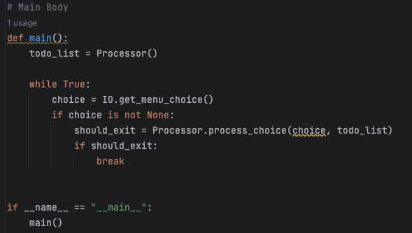
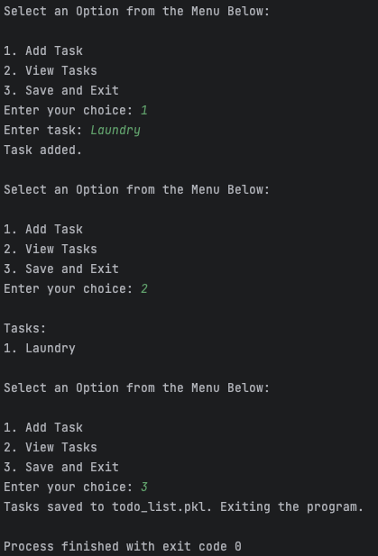
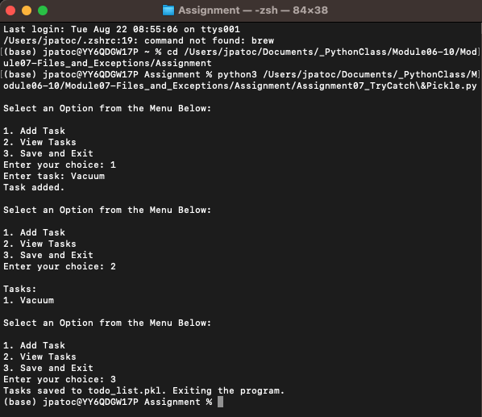
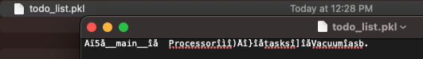

# Structured Error Handling + Pickling
**Dev:** *JPatoc*   
**Date:** *8.24.2023*  
**Course:** *IT FDN 110 A*  
**Assignment:** *07*


## Structured Error Handling (Try-Except)
When you are programming, you fix your bugs immediately and make sure the code runs smoothly. However, it often happens that other people introduce new bugs when they use your program.

### Raising Custom Errors
Python automatically generates errors based on conditions defined by the Python Runtime. However, you can also "raise" errors based on custom conditions (Listing 13). 

```
class InsufficientFundsError(Exception):
    def __init__(self, amount, balance):
        self.amount = amount
        self.balance = balance
        super().__init__(f"Insufficient funds: Trying to withdraw {amount} but balance is {balance}")

class InvalidBalanceError(Exception):
    def __init__(self, balance):
        self.balance = balance
        super().__init__(f"Invalid initial balance: {balance}. Initial balance must be positive.")

class BankAccount:
    def __init__(self, balance):
        if balance < 0:
            raise InvalidBalanceError(balance)
        self.balance = balance

    def deposit(self, amount):
        if amount <= 0:
            raise ValueError("Deposit amount must be greater than 0")
        self.balance += amount

    def withdraw(self, amount):
        if amount <= 0:
            raise ValueError("Withdrawal amount must be greater than 0")
        if amount > self.balance:
            raise InsufficientFundsError(amount, self.balance)
        self.balance -= amount

def get_valid_initial_balance():
    while True:
        try:
            initial_balance = float(input("Enter initial account balance: "))
            if initial_balance >= 0:
                return initial_balance
            else:
                print("Initial balance must be non-negative. Please try again.")
        except ValueError:
            print("Invalid input. Please enter a valid number.")

def main():
    initial_balance = get_valid_initial_balance()
    account = BankAccount(initial_balance)

    while True:
        try:
            print("1. Deposit\n2. Withdraw\n3. Exit")
            choice = int(input("Enter your choice: "))

            if choice == 1:
                deposit_amount = float(input("Enter deposit amount: "))
                account.deposit(deposit_amount)
                print(f"Deposit of {deposit_amount} successful. New balance: {account.balance}")
            elif choice == 2:
                withdrawal_amount = float(input("Enter withdrawal amount: "))
                account.withdraw(withdrawal_amount)
                print(f"Withdrawal of {withdrawal_amount} successful. New balance: {account.balance}")
            elif choice == 3:
                print("Exiting the program.")
                break
            else:
                print("Invalid choice. Please select a valid option.")

        except ValueError as ve:
            print(f"Error: {ve}. Please try again.")
        except InsufficientFundsError as ife:
            print(f"Error: {ife}. Please try again.")

if __name__ == "__main__":
    main()
```
## Pickling - Object Serialization/De-serialization
Pickling is a process in Python that involves serializing and deserializing Python objects, converting them into a byte stream that can be stored or transmitted. This enables data to be saved in a format that preserves its structure and state, allowing objects to be reconstructed later, making it useful for tasks such as data persistence and inter-process communication.

```
import pickle


def load_data_from_file(filename):
    with open(filename, "r") as file:
        lines = file.readlines()

    records = []
    for line in lines:
        cleaned_line = line.strip()
        if cleaned_line:
            parts = cleaned_line.split(",")
            if len(parts) == 2:
                first_name, age = parts
                last_name = ""  # If last name is not present in the data file
                record = {
                    "first_name": first_name,
                    "last_name": last_name,
                    "age": int(age)
                }
                records.append(record)
    return records


def print_records(records):
    print("Records:")
    for index, record in enumerate(records, start=1):
        print(f"{index}. Name: {record['first_name']} {record['last_name']}, Age: {record['age']}")


def save_data_to_pickle(data, pickle_filename):
    with open(pickle_filename, "wb") as pickle_file:
        pickle.dump(data, pickle_file)


def main():
    text_filename = "data.txt"
    pickle_filename = "data.pkl"

    data = load_data_from_file(text_filename)
    print_records(data)

    save_choice = input("Do you want to save this data to a pickle file? (yes/no): ")
    if save_choice.lower() == "yes":
        save_data_to_pickle(data, pickle_filename)
        print("Data saved to pickle file.")
    else:
        print("Data not saved.")


if __name__ == "__main__":
    main()
```

## Assignment 7 - Error Handling + Pickling

### Intro
This was a much more freeform assignment. The prompts were simple - create demos that incorporate structured error handling and pickling. I created a total of three demos one for each topic independently and one that combines both topics. This document will only look at the combined program.

Structured error handling is something that we’ve looked at in previous modules, but this was good practice to look at the topic in greater depth.

Pickling is something that I’ve heard of before, but quite honestly I never knew what it was. I’ve learned that serialization helps to preserve an object's original state without losing relevant data. It’s a quick and simple way to serialize and deserialize data for transfer and storage.

This is a simple program that allows users to enter tasks into a to-do list and saves the list to a pickle file.

### Creating the Program
It was kind of nice to not start with a script template for this program. I tried to follow the general organization of the “Separation of Concerns”

1) Data - Where ‘global’ variables are defined.
2) Processing - All of the operations on the data including: reading data from a file, adding records, deleting records, and writing data to a file.
3) Input/Output - The presentation layer of the program. This is what the end user interacts with
4) Main Body - Where Processing + Presentation are brought together. All of the functions defined in Processing and Presentation are called and coordinated here.

#### Data

The only variable I defined globally is fileName, which stores the name of the desired output file.


##### Figure 1. Variables

#### Processing

I created a class called Processor that contains three primary functions

1) add_task() - adds the user-inputted task to a list using the .append() function
2) view_tasks() - displays each task in the list or displays a message that the list is empty
3) process_choice() - performs the associated action with a user's input:
    - Adds tasks to a list
    - Displays current list of tasks
    - Saves list to pickle file and exits the program


##### Figure 2. Processor class and functions

#### Presentation (Input/Output)

The presentation layer in this assignment was much simplified compared to that of past assignments. The presentation layer is a class of itself called IO, and contains relatively simple logic. It created just a single function that displays the user menu and performs error handling if the user input is entered as non-numeric.

The function is:
- get_menu_choice() - displays the program menu, prompts for user input, and does light error handling with a try-except block


##### Figure 3. IO class and functions

#### Main Body

I created yet another function called main() for the main body of the script. It is responsible for the following:

1) Initializing the Processor class and storing it in the toDoList variable
2) Using a WHILE loop will continue to display the menu until an exit condition is met
3) Collects the user input by calling the IO.get_menu_choice function
4) Based on the user input, process the data using the Processor.process_choice function.


##### Figure 4. Main Body

#### Testing the Program

PyCharm’s integrated environment allows for writing and testing the code in a single application. I can modify the code in the IDE and quickly see the output in the pane below. This makes development, testing, and debugging easier. 


##### Figure 5a. Testing the Program in PyCharm


##### Figure 5b. Testing the Program in Terminal


##### Figure 5c. Verifying Data in Text Editor

#### Summary
This program follows a similar overall flow as many of the other programs that we’ve built. A user is presented with a menu, input is collected, and the input is ultimately saved to a file. I was a little less concerned with data types and focus more so on the overall application functionality. I did use ChatGPT to iterate on various versions of parts of the program. I found it to be very helpful.

In addition, I like [DataCamp](datacamp.com) for simple tutorials on [Exception & Error Handling](https://www.datacamp.com/tutorial/exception-handling-python) and [Pickling](https://www.datacamp.com/tutorial/pickle-python-tutorial). The site is professional, has minimal ads, and presents information in a very straightforward way. As a kicker, I thought it was cool that the site uses OpenAI to generate it’s code examples.
